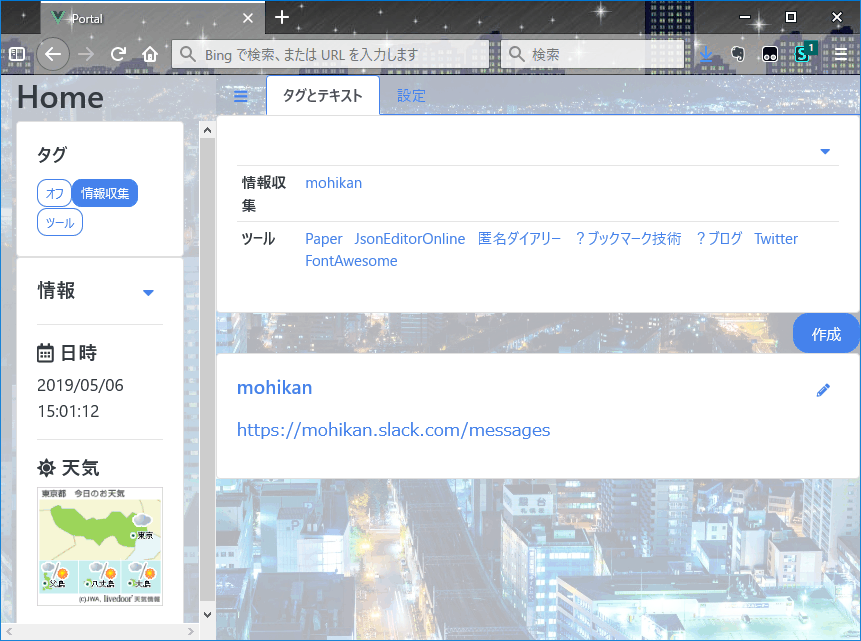

# ポータル

　ローカルにおいたファイルを直接ブラウザで開いて使うポータルです。主にリンク集として使います。

　Firefox, Chromeはファイルを開けば（`file:///`のURLで開けば）使えますが、EdgeはfileスキーマでlocalStorageが使用できないので、ローカルにWebサーバを立てる必要があります。

要 Node.js v10.13.0, yarn 1.12.3
